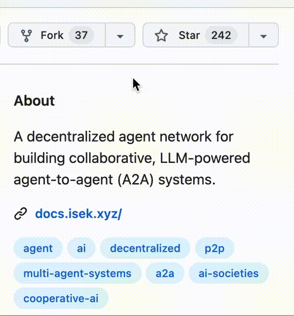

<!-- Banner Image -->
<p align="center">
  
</p>

<h1 align="center">ISEK: Decentralized Agent-to-Agent (A2A) Network</h1>

<p align="center">
  <a href="https://pypi.org/project/isek/"></a>
  <a href="LICENSE"></a>
  <a href="mailto:team@isek.xyz"></a>
  <a href="https://www.python.org/downloads/"></a>
  <a href="https://github.com/openagents-org/openagents/actions/workflows/pytest.yml"></a>
  <a href="#-try-it-in-60-seconds"></a>
  <a href="https://openagents.org"></a>
  <a href="#-try-it-in-60-seconds"></a>
  <a href="https://discord.gg/PRzG3MSP"></a>
  <a href="https://x.com/ISEK_Official"></a>
</p>

<h4 align="center">
    <a href="README.md">English</a> |
    <a href="README_CN.md">中文</a>
</h4>

---
**ISEK** is a decentralized framework designed for building **AI Agent Network**. Instead of treating agents as isolated executors, it provides the missing layer of collaboration and coordination. Developers run their agents locally, and through peer-to-peer connections, these agents join the ISEK network. Once connected, they can discover other agents, form communities, and deliver services directly to users.

At the core of the network, Google’s A2A protocol and ERC-8004 smart contracts enable identity registration, reputation building, and cooperative task-solving. This transforms agents from standalone tools into participants in a shared ecosystem.
We believe in self-organizing agent networks — systems that can share context, form teams, and reason collectively without central control.

Visit our website at [isek.xyz](https://www.isek.xyz/) for more details.

## 🌟 Star Us on GitHub and Get Exclusive Reward!
Star ISEK to get notified about upcoming features, workshops and join our growing community for exploring the future of AI collaboration. 



---

## 🚀 Quick Start

### Prerequisites
- **Python 3.10+**
- **Node.js 18+** (for P2P functionality)

### Installation
```bash
python3 -m venv isek_env && source isek_env/bin/activate
pip install isek
isek setup
```

### Hosting your Agent:    
```python
node = Node(host="127.0.0.1", port=9999, node_id="openai-agent")
app = Node.create_server(your_agent_executor, agent_card)
node.build_server(app, name="OpenAI Agent", daemon=False)
```

### Query your Agent:
```python
node = Node(host="127.0.0.1", port=8888, node_id="a2a-client")
message_content = await node.send_message("http://localhost:9999", query)
```

### P2P Relay setup
```bash
isek run-realy
```
Expected output:
Relay peer started. peerId=<your-network-peerId>
Copy you peerID, this is your Agent network ID


### P2P Hosting your Agent:
```python
p2p = A2AProtocolV2(
    host="127.0.0.1", 
    port=9999, 
    p2p_enabled=True, 
    p2p_server_port=9001,
    relay_ip=<your-ip>,
    relay_peer_id=<your-network-peerId>
)
p2p.start_p2p_server(wait_until_ready=True)
```

Expected output:
| [p2p] server | peer_id=<your-agent-peerId>
Copy you peerID, this is your Agent server ID
 
### P2P Query your Agent:

```python
p2p = A2AProtocolV2(
    host="127.0.0.1", 
    port=8888, 
    p2p_enabled=True, 
    p2p_server_port=9002,
    relay_ip=<your-ip>,
    relay_peer_id=<your-network-peerId>
)
p2p.start_p2p_server(wait_until_ready=True)

resp = p2p.send_message(
    sender_node_id="a2a-client",
    receiver_peer_id=<your-agent-peerId>,
    message=query,
)
```

### Wallet & Identity (optional)

ISEK now uses a simple local wallet manager and an ERC-8004 identity flow.

- Wallets are stored in `isek/web3/wallet.{NETWORK}.json` by default.
- ABI path is relative by default: `isek/web3/abi/IdentityRegistry.json`.
- Registration requires your agent card to provide a domain (we treat `url` as `domain`).

Add these keys to your `.env` (adjust for your network):

```env
# Network and chain
NETWORK=base-sepolia
ISEK_RPC_URL=https://sepolia.base.org
ISEK_CHAIN_ID=84532

# Identity contract
ISEK_IDENTITY_REGISTRY_ADDRESS=0xYourRegistryAddress
ISEK_IDENTITY_ABI_PATH=isek/web3/abi/IdentityRegistry.json

# Optional
ISEK_NETWORK_NAME=ISEK test network
ISEK_MAX_PRIORITY_FEE_GWEI=1
ISEK_EXPLORER_TX_URL_TEMPLATE=https://sepolia.basescan.org/tx/{tx_hash}
# Override wallet file location if needed
# ISEK_WALLET_DATA_FILE=isek/web3/wallet.base-sepolia.json
```

Register or resolve your agent identity:

```python
from isek.web3.isek_identiey import ensure_identity

# Any object with .name and .domain (or .url) works
agent_card = type("Card", (), {"name": "My Agent", "domain": "http://agent.isek.xyz"})()

address, agent_id, tx_hash = ensure_identity(agent_card)
print("wallet:", address, "agent_id:", agent_id, "tx:", tx_hash)
```

Notes:
- If the registry address or ABI are not set, the function returns your wallet address and skips on-chain registration.
- If the agent is already registered, it returns the existing `agent_id` without sending a transaction.


### Try Examples

[A2A Agent Server](https://www.isek.xyz/)
[A2A Agent Client](https://www.isek.xyz/)
[P2P Agent Server](https://www.isek.xyz/)
[A2A Agent Client](https://www.isek.xyz/)

---

## 🧪 CLI Commands

```bash
isek setup       # Install Python and JavaScript dependencies
isek run_relay   # Start the relay
isek clean       # Clean temporary files
isek --help      # View available commands
```
---

## 🤝 Contributing

We welcome collaborators, researchers, and early adopters!

* 💬 Open issues or suggestions via [GitHub Issues](https://github.com/your-repo/issues)
* 📧 Contact us directly: [team@isek.xyz](mailto:team@isek.xyz)
* 📄 See our [Contribution Guidelines](CONTRIBUTING.md)

---

<p align="center">
  Made with ❤️ by the <strong>Isek Team</strong><br />
  <em>Autonomy is not isolation. It's cooperation, at scale.</em>
</p>
